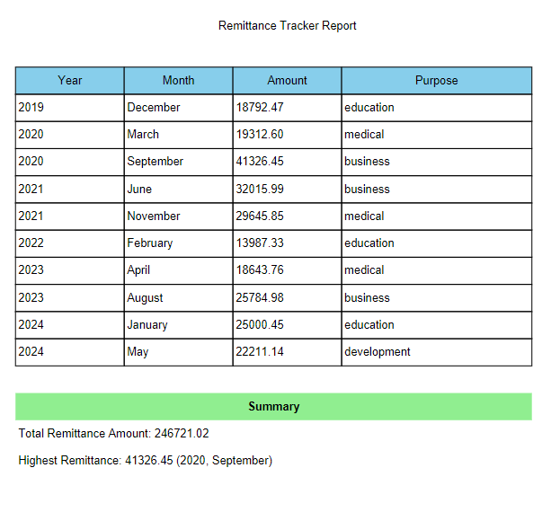

# Remittance Record Tracker

This is a Python program to track and visualize remittance transactions. It allows users to record details of remittances, view records, analyze trends, generate graphs, and export data to PDF.

## Features

- **Add Transaction**: Input sender, recipient, amount, currency, and date of remittance.
- **View Records**: Display all remittance records in a tabular format.
- **Visualize Data**: Generate graphs to show trends in remittance amounts over time.
- **Analyze Data**: Calculate total remittances, average remittance per transaction, and the highest remittance amount.
- **Export to PDF**: Save the records and analysis as a PDF report.

## Installation

Install the required libraries using `pip`:

```bash
pip install matplotlib tabulate fpdf
```

## How to Use

1. **Run the Program**: Execute the program by running `main.py`.

   ```bash
   python main.py
   ```

2. **Choose an Option**: The menu includes the following options:
   - Add a remittance transaction.
   - View all remittance records.
   - Export records to a PDF.
   - Visualize remittance trends.
   - Analyze remittance data.
   - Exit the program.

3. **Add Transaction**: Enter details like sender name, recipient name, amount, currency, and date.

4. **View Records**: Display all recorded remittances in a table.

5. **Visualize Data**: Generate a graph showing remittance trends over months or years.

6. **Analyze Data**: View summary statistics like total remittance, average per transaction, and the largest remittance amount.

7. **Export to PDF**: Create a PDF report of all records and summaries.

## File Format

Data is stored in a JSON file named `remittance_data.json`. Each record has the following format:

```json
{
  "sender": "John Doe",
  "recipient": "Jane Smith",
  "amount": 500.00,
  "currency": "USD",
  "date": "2025-01-02"
}
```

## Example Output

### 1. Sample Table


### 2. Sample Graph
- A graph showing monthly or yearly remittance trends.
#### Yearly Preview

#### Monthly Preview


### 3. Exported PDF
- Includes a table of all records and summary statistics.


## License

This project is open-source and available under the MIT License.

## Contributing

Feel free to fork this repository and contribute to improvements. If you have suggestions or bug fixes, please open an issue or submit a pull request.

## Author

This project is developed by **Protik Das Utso**. You can reach me via email at [anamulhaque9455@gmail.com](mailto:anamulhaque9455@gmail.com) or WhatsApp at [Click to message me](https://wa.me/8801703989455).
